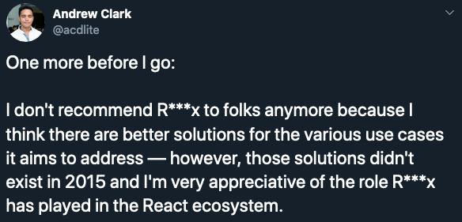
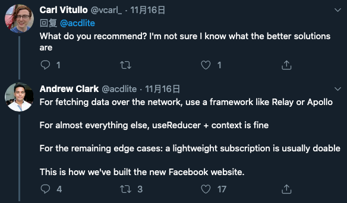

# Reduz

> A `react` state management tool based on `useReducer` and `context`

`Reduz` is just a toy, it has not NPM package, DO NOT use it in production.

## Motivation

I decided to write this tool because of some [tweets](https://twitter.com/acdlite/status/1195445938308780032):

[@acdlite](https://twitter.com/acdlite) said `"there are better solutions"` to replace `Redux`.

Someone([@vcarl\_](https://twitter.com/vcarl_)) asked him `"what the better solutions are"`, the answer mentioned `"useReducer + context is fine"`.

So I just can't wait to implement it for fun ❤️.

## Storybook(demos)

[Storybook](https://liyuanqiu.github.io/reduz/packages/storybook/storybook-static)

## Roadmap

- [ ] Readme
- [ ] Document
- [ ] reduz-middleware
- [ ] reduz-logger
